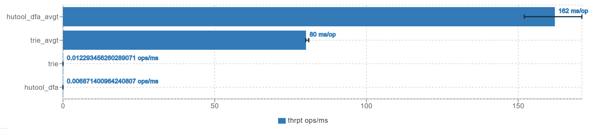

# 敏感词过滤
敏感词过滤算法采用前缀树，主要支持：
1. 贪婪匹配
2. 密集匹配
3. 跳词
4. 不阻塞读，线程安全的情况下热更新（增删）。

核心代码三百行左右，集中在 `Trie` 类中。后期有考虑 升级为 AC自动机，但该数据结构稍有复杂，我不确定我是否能 hold 住，因此暂时先搁置。

## Benchmark
测试代码在 `BenchmarkTest` 下，测试结果如下：

## 过滤程度
本模块以 hutool-dfa 做测试验证，仓库中附带敏感词过滤词库和测试用例。经测试，不论是贪婪匹配，
还是密集匹配，针对`text.txt`测试用例，本仓库采用的前缀树算法过滤后所得字符串 `text1`，与 hutool-dfa 过滤后的字符串 `text2`
求最长公共子序列的长度，除以 `text2` 的长度，均能达到 0.99 以上，即近似认为达到了 99% 的过滤程度（假定`text2`是正确答案）。

## 效率
* 密集匹配：当过滤长字符串时（`text.txt`长度为 76047），本仓库前缀树过滤所需耗时大约在 hutool-dfa 的 2/3 左右。字符串长度较短时差距不明显甚至低于 hutool-dfa
* 贪婪匹配：耗时大概也在 hutool-dfa 的 2/3 左右
> 字符串长度越长，本算法耗时与 hutool-dfa 耗时相比，比值越小。另外，也测试了 `text2.txt` 作比较，但由于字符串长度太长 2690513，所以求 lcs 时在我电脑上没跑完😅，因此算不出重复率，感兴趣可以自己跑一下

## 跳词
跳词做的比较粗糙，没有详细探究市场上现在是怎么做的，我这里只是简单地判断了一下是不是东亚单词。跳词这里的设计考虑地不够全面。

## 热更新
1. 前缀树设计成 immutable
2. ~~对前缀树写操作设计为 cow，因为不想阻塞读，且即使有热更新，应该也不会太过频繁，因此写可以接受低效一点。不过 COW 时需要注意引用类型，特别是 `Map` 和 `TrieNode`，`Character` 是 immutable 的，因此不用管。由于嵌套层级不深，所以
后序遍历，手动做 copy，而没有考虑序列化反序列化的方案~~
3. ~~写写互斥，避免写并发导致丢失更新~~
4. 原先的热更新为 COW，但是需要写写互斥以避免丢失更新。但写操作一旦并发上来性能堪忧（虽然此场景下不存在）。所以继续迭代，汲取`ConcurrentHashMap`的思想，基于分段锁来实现。
思路也很简单，就是尽可能降低竞争，直到不得不竞争。如增加操作，一直到待添加的节点处再开始加锁，相当于 `ConcurrentHashMap` 的链表头结点的 `synchronized`。
如果根节点的子节点为 null，在 `ConcurrentHashMap` 中是 cas 上去，然后 retry 重新加锁遍历 bucket。我最开始也是利用反射写的很麻烦这样做的，但这样问题在于，扩容有问题，而且我也修改不了 modCount，强制反射 cas 到 `HashMap` 的
`table` 上可能会导致许多想不到的问题。所以对于根节点的子节点为 null（对应 `ConcurrentHashMap` 链表头节点为 null），不再反射+cas来做，直接一把大锁锁所有的 null，然后 put 上去后再开始遍历找分歧点做分段锁。另外如果用 `HashMap`，读不加锁则无法解决读-扩容问题，
所以 `TrieNode` 的 `HashMap` 换成 `ConcurrentHashMap`

## todo
目前想到的，还可以做优化的点：
1. ~~cow：可以考虑用原型模式，先 clone()，浅拷贝，然后只更新变动的点。最笨的 COW 是无脑 copy 整棵前缀树，然后更新根节点，但这显然不合理，因为
不是整棵树大范围都要做更新，更新的可能只是从根节点开始的某个分支，因此优化可以只 COW 某个分支。但还能进一步再优化，因为这条分支上也不是所有的点都要动，所以可以找到为 null 的待插入的槽，然后做添加。
删除操作不是真的删除，因为路径上还要其他的点，所以这里只是简单对 `isEndingChar` 设置为 false。~~
2. ~~写锁的粒度，现在写锁是锁整棵树，可以考虑锁某个分支~~
3. 跳词的设计，可以考虑更加全面的设计，比如跳词的长度，跳词的位置，跳词的类型等等

1 和 2 已经更换，添加时不再需要复制树，基于分段锁来做。跳词的话，我能想到的是编辑距离来做，但这样效率太低，商业化跳词检测可能需要 NLP 支持。